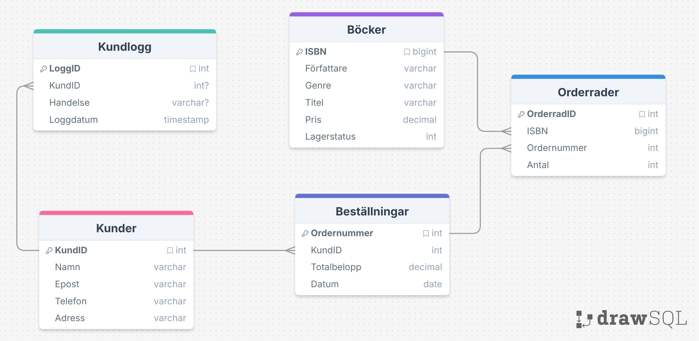

## En liten bokhandel (inlämning2) utfört av Alexander Johansson från YH25

Jag har skapat en relationsdatabas till en liten bokhandel (e-handel). Här måste man vara kund för att lägga beställningar på olika böcker.

Relationerna gör det möjligt för
* En kund att ha en eller flera beställningar (1–M)
* En bok kan förekomma i många beställningar (1–M)
* En beställning kan ha flera orderrader (1–M), d.v.s flera böcker i samma beställning.
* Många till Många (N:M) relation mellan böcker och beställningar

## Tabeller
* Kunder - Innehåller information om varje kund (alla kunder är unika)
* Beställningar - Innehåller kundernas beställningar
* Böcker - Innehåller butikens produkter i form av böcker 
* Orderrader - Varje orderrad är unik och är kopplad till en specifik beställning samt specifik bok (ISBN)

## Vad har jag stött på under skapandet av databas-strukturen?
Jag insåg att jag hade AUTO_INCREMENT på ISBN i Bocker-tabellen, så jag ändrade det till BIGINT. Varje bok har sitt unika ISBN och därför blir det inte korrekt att auto-generera värdet.

# Reflektion och Analys
## Vilken data är viktig att testa i en bokhandel? 
- Det är viktigt att blandannat testa så att CHECK fungerar så att priset inte kan vara 0. Det är även viktigt att testa att registrera två likadana epost-adresser. Detta för att påvisa att det inte är möjligt på grund av att attributen har UNIQUE constraint. Något annat som är viktigt att testa är att triggers fungerar för uppdatering av lagersaldo.

## Varför valde jag att designa relationsdatabasen på detta sättet?
- Jag valde att designa relationsdatabasen så här för att få till normalisering vilket utmärker en relationsdatabasdesign. Jag har blandannat delat upp Orderrader och Beställning i olika tabeller för att säkerställa att data inte dupliceras. Utifrån dataintegritets-synvinkel så har jag använt mig av constraints som primary key, foreign key, unique, check, index som säkerställer att bokhandelskonceptet fungerar som tänkt. Med det menar jag att en beställning kan inte finnas om det inte finns en kund samt att inga böcker kan beställas om de inte existerar i Bocker-tabellen.

## Vad skulle jag ändra om databasen skulle hantera 100 000 kunder istället för 10?
- Jag skulle förmodligen ha något sätt att arkivera/rensa gamla kundloggar från kundlogg-tabellen just för att jag har trigger på uppdatera nya kunder. Utöver det så skulle jag vilja indexera fler kolumner som används ofta just för att databasen ska kunna hitta datan snabbare (ökad prestanda). Till sist så hade jag velat undvika queries som blir för påfrestande (SELECT * FROM KUNDER;) och istället använd WHERE för att minska mängd data att scanna.

## Diskutera vilka optimeringar som kan göras i index och struktur för att förbättra prestandan
- Gällande optimeringar som kan göras i index så skulle jag vilja indexera även kolumner som används frekvent i join-satserna, exempelvis ISBN i Orderrader och KundID i bestallningar-tabellen. Vad gäller strukturen så skulle man kunna dela upp beställningar till två nya tabeller Gamla_Bestallningar och Nya_Bestallningar för att kunna ha separata lagringsytor.

## ER-diagram
Så här ser mitt ER-diagram ut till uppgiften:

